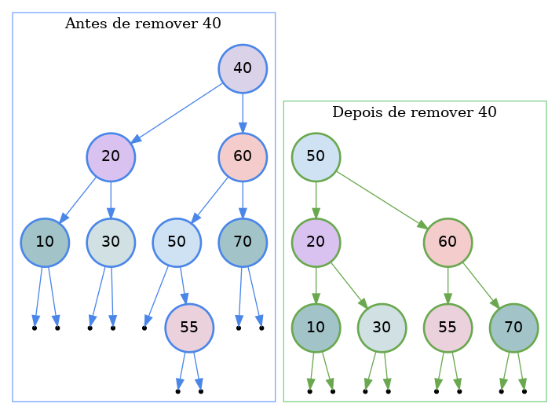

# T11 - Árvores binárias - Semana 27/04/26

## Parte 1 - 27/04/26

Sumário: Estruturação de projectos em C: header files, bibliotecas estáticas e dinâmicas. Algoritmos de pesquisa em árvores binárias.

1. `libs/` - pasta com exemplo de estruturação de projecto em C; "header files" (ficheiros `.h`) e respectivos ficheiros `.c`. Criação de bibliotecas estáticas e dinâmicas. Contém ficheiro README.md.

2. `abin2.c` - continuação do estudo de árvores binárias: pesquisa exaustiva e pesquisa em árvores binárias de pesquisa.

## Parte 2 - 28/04/26

Sumário: Algoritmos de inserção e remoção de elementos em árvores binárias de procura.

1. `abin3.c` - programa exemplo para gerar imagens `.png` que demonstram o estado da árvore. 

Um exemplo de uma imagem criada pelo programa para a operação de remoção do elemento 40 de uma árvore:

Note que a utilização do programa vai gerando imagens para cada operação. É recomendada a utilização do programa e consulta das imagens correspondentes para consolidar os conhecimentos sobre árvores.
